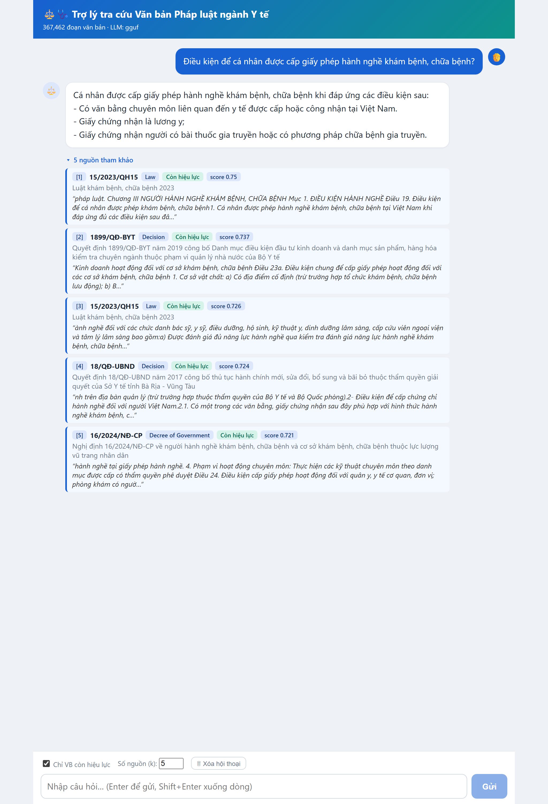
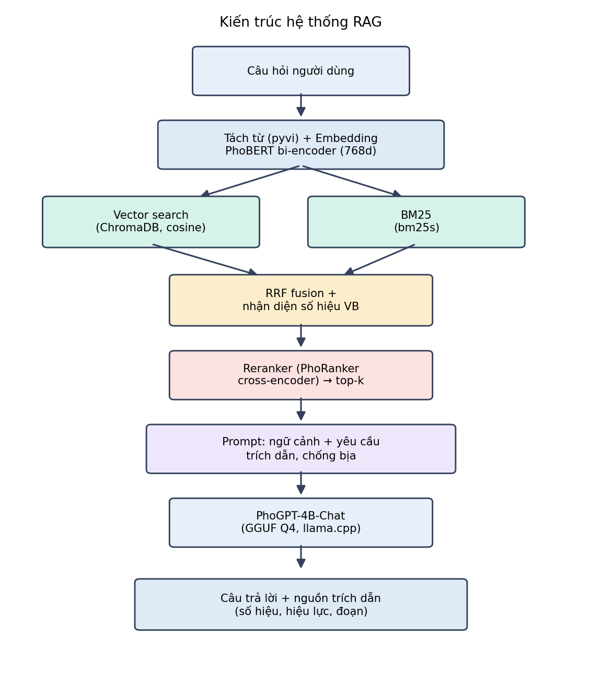
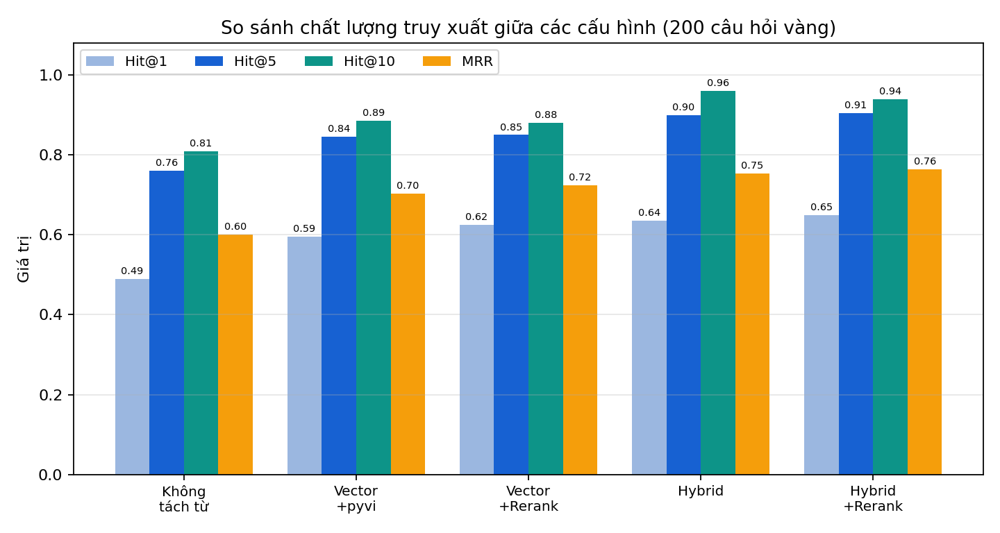

<div align="center">

# 🩺⚖️ RAG Tra cứu Văn bản Pháp luật ngành Y tế Việt Nam

**Chatbot hỏi–đáp dựa trên kiến trúc Retrieval-Augmented Generation (RAG), trả lời kèm trích dẫn số hiệu văn bản — chạy hoàn toàn trên CPU.**


</div>

---

## 📌 Giới thiệu

Hệ thống tra cứu **văn bản quy phạm pháp luật ngành y tế Việt Nam** bằng ngôn ngữ tự nhiên. Người dùng đặt câu hỏi tiếng Việt và nhận câu trả lời **bám sát văn bản gốc, kèm trích dẫn số hiệu** — khắc phục hai điểm yếu cố hữu: tìm kiếm từ khóa không hiểu ngữ nghĩa, và hỏi trực tiếp LLM thì dễ "bịa" và không truy được nguồn.

Toàn bộ pipeline được tối ưu để **chạy trên máy cá nhân (CPU, 16GB RAM, không GPU)**.

## 🎬 Demo

<div align="center">


*Giao diện hỏi–đáp: câu trả lời của PhoGPT kèm các nguồn trích dẫn (số hiệu, loại văn bản, tình trạng hiệu lực, điểm liên quan).*
</div>

## ✨ Tính năng

- 🔎 **Tìm kiếm ngữ nghĩa** bằng embedding PhoBERT (bi-encoder, 768 chiều) + ChromaDB.
- 🔀 **Hybrid search** (BM25 + vector, hợp nhất RRF) — bắt đúng cả truy vấn theo **số hiệu văn bản**.
- 🎯 **Reranker** cross-encoder PhoRanker để xếp hạng lại, tăng độ chính xác.
- 💬 **Sinh câu trả lời** bằng PhoGPT-4B-Chat (lượng tử hóa GGUF) — có ràng buộc trích dẫn, hạn chế bịa đặt.
- ✅ Chỉ tư vấn **văn bản còn hiệu lực**; hiển thị nguồn rõ ràng.
- 🖥️ Giao diện web (React) — lịch sử hội thoại, **chạy offline**.

## 🏗️ Kiến trúc

<div align="center">

</div>

```
Câu hỏi → tách từ (pyvi) + embedding PhoBERT
        → [Vector (ChromaDB)  +  BM25]  → RRF + nhận diện số hiệu
        → Reranker (PhoRanker)  → PhoGPT sinh câu trả lời + trích dẫn
```

## 📊 Kết quả đánh giá

Trên bộ 18 câu hỏi vàng (neo vào các luật y tế, có bổ sung văn bản hợp nhất tương đương):

| Cấu hình | Hit@1 | Hit@5 | Hit@10 | MRR |
|----------|:-----:|:-----:|:------:|:---:|
| Vector + tách từ | 0.389 | 0.833 | 0.944 | 0.586 |
| Vector + Reranker | 0.500 | 0.889 | 0.889 | 0.644 |
| Hybrid (BM25+vector) | 0.556 | 0.889 | **1.000** | 0.687 |
| **Hybrid + Reranker** | **0.556** | **0.944** | 0.944 | **0.722** |

<div align="center">

</div>

> Chi tiết: [`eval/results.md`](eval/results.md). Mỗi kỹ thuật (tách từ, reranker, hybrid, kích thước chunk) được kiểm chứng bằng **thí nghiệm A/B**.

## 🧰 Công nghệ

| Thành phần | Lựa chọn |
|---|---|
| Embedding | `bkai-foundation-models/vietnamese-bi-encoder` (PhoBERT) |
| Vector DB | ChromaDB (HNSW, cosine) |
| Lexical | BM25 (`bm25s`) + RRF |
| Reranker | `itdainb/PhoRanker` |
| LLM | `vinai/PhoGPT-4B-Chat` (GGUF Q4_K_M, llama.cpp) |
| Backend / Web | FastAPI + React |

## 📂 Cấu trúc dự án

```
├── build_chunks.py          # Lọc, làm sạch, chunk theo "Điều"
├── index_chroma.py          # Embedding PhoBERT + ChromaDB
├── build_bm25.py            # Chỉ mục BM25
├── rag_core.py / hybrid.py  # Truy xuất vector / hybrid + nhận diện số hiệu
├── rerank.py                # Reranker PhoRanker
├── llm.py                   # Sinh câu trả lời (PhoGPT GGUF)
├── app.py + static/         # Backend FastAPI + giao diện web
├── eval/                    # Bộ câu hỏi vàng + đánh giá Hit@k/MRR
└── report/                  # Báo cáo, hình, kịch bản demo
```

## 🚀 Cài đặt & chạy

```bash
# 1. Cài thư viện
pip install -r requirements.txt
pip install llama-cpp-python --extra-index-url https://abetlen.github.io/llama-cpp-python/whl/cpu

# 2. Tạo dữ liệu & chỉ mục (dữ liệu tải tự động từ Hugging Face)
python build_chunks.py        # -> legal_medical_chunks_clean.parquet
python index_chroma.py        # -> chroma_db/  (embedding, ~13h trên CPU, resume được)
python build_bm25.py          # -> bm25_index/
python download_gguf.py       # -> models/PhoGPT-4B-Chat-Q4_K_M.gguf (2.36GB)

# 3. Chạy web (PowerShell)
$env:LLM_MODE="gguf"; $env:USE_HYBRID="1"; $env:USE_RERANK="1"
uvicorn app:app --port 8000
# Mở http://localhost:8000
```

> ⏱️ Câu hỏi đầu tiên mất ~90s nạp mô hình; các câu sau ~20–40s (CPU).
> 📄 Kịch bản demo & các tình huống thử nghiệm: [`DEMO_SCRIPT.md`](DEMO_SCRIPT.md).

## 📈 Dữ liệu

- Nguồn: [`th1nhng0/vietnamese-legal-documents`](https://huggingface.co/datasets/th1nhng0/vietnamese-legal-documents) — 518k văn bản pháp luật VN.
- Lọc ngành y tế còn hiệu lực: **21.490 văn bản → 367.462 đoạn (chunk)** sau khi làm sạch & khử trùng lặp.

## 🔭 Hướng phát triển

- Mở rộng bộ đánh giá; đo độ trung thực (faithfulness) tự động.
- Contextual chunking; hỗ trợ hội thoại đa lượt.
- Mở rộng sang các lĩnh vực pháp luật khác.

## 📜 Giấy phép

[MIT](LICENSE) © 2026 Nguyễn Minh Hiếu — Đồ án tốt nghiệp, Khoa CNTT, Trường Đại học Thủy lợi.
